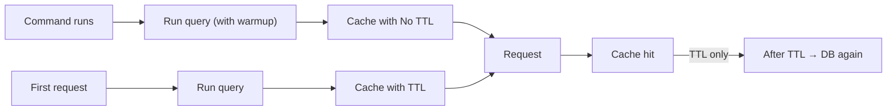

# Cache Pre-Warming

> **Currently in beta**

[](https://github.com/CodeWithDennis/cache-pre-warming/actions/workflows/tests.yml)
[](https://github.com/CodeWithDennis/cache-pre-warming/blob/master/LICENSE.md)
[](https://packagist.org/packages/codewithdennis/cache-pre-warming)
[](https://laravel.com)

This package does two things.

**Normal caching** — Add the trait to a model and every query is cached after it runs. First run hits the database and stores the result; later runs with the same query get the result from cache. The cache expires after a set time (default 10 minutes).

**Pre-warming** — Call `warmup()` before a query and run that query once (e.g. in a scheduled command). The result is cached with no expiry. The first visitor and everyone after get the result from cache, so no one pays for a slow first request.

---

## Installation

```bash
composer require codewithdennis/cache-pre-warming
```

---

## Setup

Add the trait to any model:

```php
use CodeWithDennis\CachePreWarming\Traits\HasCache;

class User extends Model
{
    use HasCache;
}
```

You get both: normal caching (queries cached, expire after a set time) and pre-warming (call `warmup()`, run the query once, cache never expires). Use each where it fits.

---

## Pre-warming

Use pre-warming for data that rarely changes: dashboard stats, totals, reference data. Call `warmup()` before the query. Run that query once (e.g. in a scheduled command). The result is stored in cache with no expiry. Every later request that runs the same query gets the value from cache.

**Example**

```php
$stats = User::query()
    ->where('active', true)
    ->where('created_at', '>=', now()->startOfMonth())
    ->orderBy('created_at')
    ->warmup()
    ->get();
```

**Run it in a command**

Put the query in a Laravel command and schedule it (e.g. hourly or after deploy). When the command runs, it fills the cache. The next user request gets the result from cache.

```php
// app/Console/Commands/WarmCache.php
class WarmCache extends Command
{
    protected $signature = 'cache:warm';

    public function handle(): int
    {
        User::query()
            ->where('active', true)
            ->where('created_at', '>=', now()->startOfMonth())
            ->orderBy('created_at')
            ->warmup()
            ->get();

        return self::SUCCESS;
    }
}
```

```php
// routes/console.php
Schedule::command('cache:warm')->hourly();
```

---

## Normal caching

Use the model as usual (do not call `warmup()`). The first time you run a query it hits the database and stores the result in cache. The next times you run the same query you get the result from cache until the cache expires (default 10 minutes). After that the next request hits the database again.

**Example**

```php
$users = User::query()
    ->where('active', true)
    ->orderBy('name')
    ->get();
```

---

## How it works (diagram)



Left path: pre-warming (cache forever). Right path: normal caching (cache for a set time; when it expires, the next request hits the database again).

---

## Configuration

**Change how long the cache lasts (normal caching only)**  
Default is 600 seconds (10 minutes). Override in your model:

```php
public function cacheTtl(): int
{
    return 3600; // 1 hour
}
```

or

```php
protected int $cacheTtl = 300; // 5 minutes
```

**What does warmup() do?**  
It only changes one thing: the result is stored with no expiry instead of using the model’s TTL. Same caching behaviour, no expiry.

**Supported methods (both normal caching and pre-warming)**  
`get`, `first`, `find`, `findMany`, `pluck`, `value`, `sole`, `count`, `exists`, `doesntExist`, `sum`, `avg`, `average`, `min`, `max`, `paginate`, `simplePaginate`.

---

## Requirements

- PHP 8.4+
- Laravel 12.x

Uses your Laravel cache (see `config/cache.php`). Models without the trait are not cached.

---

## License

MIT. See [LICENSE.md](LICENSE.md) for details.
