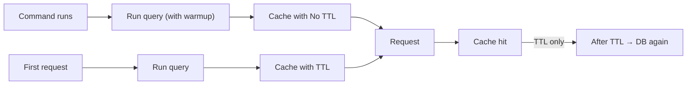

# Cache Pre-Warming

> **Currently in beta**

[](https://github.com/CodeWithDennis/cache-pre-warming/actions/workflows/tests.yml)
[](https://github.com/CodeWithDennis/cache-pre-warming/blob/master/LICENSE.md)
[](https://packagist.org/packages/codewithdennis/cache-pre-warming)
[](https://laravel.com)

Add the trait to a model and get TTL-based query caching. Optionally use pre-warming to cache heavy queries indefinitely.

---

## Installation

```bash
composer require codewithdennis/cache-pre-warming
```

**Cache driver:** Use a driver that supports tags (`array`, `redis`, or `memcached`). The `file` and `database` drivers do not support tagging; cache invalidation on model events will not work with them.

Add the trait to any model:

```php
use CodeWithDennis\CachePreWarming\Traits\HasCache;

class User extends Model
{
    use HasCache;
}
```

---

## Part 1: Normal Caching

With the trait added, every query is cached after it runs. The first run hits the database and stores the result; later runs with the same query read from cache until it expires (default 10 minutes).

**Use it for:** data that changes now and then.

**Example**

```php
$users = User::query()
    ->where('active', true)
    ->orderBy('name')
    ->get();
```

The first call hits the database. The next calls with the same query use the cache until the TTL expires, then the next request refreshes it from the database.

**Configuration** — Change how long the cache lasts:

```php
public function cacheTtl(): int
{
    return 3600; // 1 hour
}
```

or

```php
protected int $cacheTtl = 300; // 5 minutes
```

---

## Part 2: Pre-Warming (additional feature)

Pre-warming caches a query indefinitely by running it ahead of time (e.g. in a scheduled command). The first visitor and everyone after get the result from cache—no slow first request.

**Why use it?** — Without pre-warming, the first user who hits a heavy query pays the full cost: the database runs it, and they wait. Everyone else benefits from the cache. Pre-warming runs that query once (e.g. in a scheduled job or right after deploy) and fills the cache. When the first user arrives, the result is already there—no cold start.

**Use it for:** data that rarely changes—dashboard stats, totals, reference data.

**Example**

Call `warmup()` before the query:

```php
$stats = User::query()
    ->where('active', true)
    ->where('created_at', '>=', now()->startOfMonth())
    ->orderBy('created_at')
    ->warmup()
    ->get();
```

**Run it in a command** — Put the query in a Laravel command and schedule it (e.g. hourly or after deploy). When the command runs, it fills the cache. The next user request gets the result from cache.

```php
// app/Console/Commands/WarmCache.php
class WarmCache extends Command
{
    protected $signature = 'cache:warm';

    public function handle(): int
    {
        User::query()
            ->where('active', true)
            ->where('created_at', '>=', now()->startOfMonth())
            ->orderBy('created_at')
            ->warmup()
            ->get();

        return self::SUCCESS;
    }
}
```

```php
// routes/console.php
Schedule::command('cache:warm')->hourly();
```

**What does warmup() do?** — It stores the result with no expiry instead of using the model’s TTL. Same caching behaviour, no expiry.

---

## How it works (diagram)



Left path: pre-warming (cache forever). Right path: normal caching (cache for a set time; when it expires, the next request hits the database again).

---

## Supported methods

Both normal caching and pre-warming support:  
`get`, `first`, `find`, `findMany`, `pluck`, `value`, `sole`, `count`, `exists`, `doesntExist`, `sum`, `avg`, `average`, `min`, `max`, `paginate`, `simplePaginate`.

---

## Requirements

- PHP 8.4+
- Laravel 12.x

Uses your Laravel cache (see `config/cache.php`). Models without the trait are not cached.

---

## License

MIT. See [LICENSE.md](LICENSE.md) for details.
