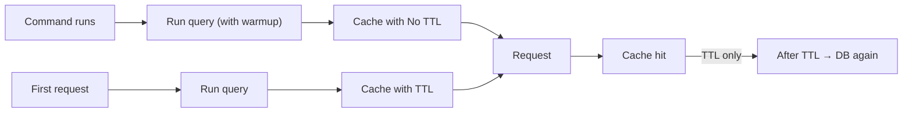

# Cache Pre-Warming

[](https://github.com/CodeWithDennis/cache-pre-warming/actions/workflows/tests.yml)
[](https://github.com/CodeWithDennis/cache-pre-warming/blob/master/LICENSE.md)
[](https://packagist.org/packages/codewithdennis/cache-pre-warming)
[](https://laravel.com)

Cache your Eloquent query results. When you add the trait, every query on that model is cached after it runs. The only difference is how long the cache lasts: call `warmup()` and the cache never expires; don’t call it and the cache expires after a set time (default 10 minutes).

---

## Installation

```bash
composer require codewithdennis/cache-pre-warming
```

---

## Setup

Add the trait to any model:

```php
use CodeWithDennis\CachePreWarming\Traits\HasCache;

class User extends Model
{
    use HasCache;
}
```

Queries on that model are cached after they run. With `warmup()` the cache never expires; without it the cache expires after a set time.

---

## Warmup: cache forever

Use this for data that rarely changes: dashboard stats, totals, reference data. Call `warmup()` before the query. Run that query once (for example in a scheduled command). The result is saved in cache with no expiry. Every later request that runs the same query gets the value from cache, so the first visitor and everyone after get a fast response.

**Example**

```php
$stats = User::query()
    ->where('active', true)
    ->where('created_at', '>=', now()->startOfMonth())
    ->orderBy('created_at')
    ->warmup()
    ->get();
```

**Run it in a command**

Put the query in a Laravel command and schedule it (e.g. hourly or after deploy). When the command runs, it fills the cache. The next user request already gets the result from cache.

```php
// app/Console/Commands/WarmCache.php
class WarmCache extends Command
{
    protected $signature = 'cache:warm';

    public function handle(): int
    {
        User::query()
            ->where('active', true)
            ->where('created_at', '>=', now()->startOfMonth())
            ->orderBy('created_at')
            ->warmup()
            ->get();

        return self::SUCCESS;
    }
}
```

```php
// routes/console.php
Schedule::command('cache:warm')->hourly();
```

---

## Default: cache for a set time

Use the model as usual (do not call `warmup()`). The first time you run a query it hits the database and saves the result in cache. The next times you run the same query you get the result from cache until the cache expires (default 10 minutes). Then the next request hits the database again.

**Example**

```php
$users = User::query()
    ->where('active', true)
    ->orderBy('name')
    ->get();
```

---

## How it works (diagram)



Left path: warmup (cache forever). Right path: normal (cache for a set time; when it expires, the next request hits the database again).

---

## Configuration

**Change how long the cache lasts (option 2 only)**  
Default is 600 seconds (10 minutes). Override in your model:

```php
public function cacheTtl(): int
{
    return 3600; // 1 hour
}
```

or

```php
protected int $cacheTtl = 300; // 5 minutes
```

**What does warmup() do?**  
It only changes one thing: the result is stored with no expiry instead of using the model’s TTL. Same caching, no expiry.

**Supported methods**  
`get`, `first`, `find`, `findMany`, `pluck`, `value`, `sole`, `count`, `exists`, `doesntExist`, `sum`, `avg`, `average`, `min`, `max`, `paginate`, `simplePaginate`.

---

## Requirements

- PHP 8.4+
- Laravel 12.x

---

## License

MIT. See [LICENSE.md](LICENSE.md) for details.
