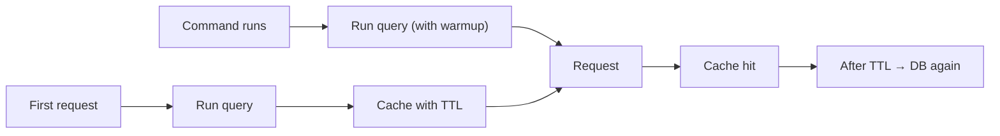

# Cache Pre-Warming

[](https://github.com/CodeWithDennis/cache-pre-warming/actions/workflows/tests.yml)
[](https://github.com/CodeWithDennis/cache-pre-warming/blob/master/LICENSE.md)
[](https://packagist.org/packages/codewithdennis/cache-pre-warming)
[](https://laravel.com)

This package does both: **pre-warm** heavy or static queries (cache forever) and **cache** other queries with a TTL. Pre-warm by running a query once in a scheduled command with **warmup**—the result is cached forever, so the first visitor and everyone after get a fast response. Without warmup, the same trait caches queries with a configurable TTL.

---

## Installation

```bash
composer require codewithdennis/cache-pre-warming
```

---

## Why warmup?

Heavy queries—dashboard stats, totals, reference data—either run on every request (expensive) or make the first request slow when the cache is empty. With normal TTL caching you still pay that cost whenever the cache expires or is cold.

**Warmup flips that.** Run the query once in a Laravel command (on a schedule or right after deploy). The result is stored with `Cache::rememberForever()`. From then on, every identical query in your app gets the result from cache. No expiry. And because the command fills the cache before users hit the app, **no one is punished for being the first visitor**—the cache is already warm. Clear the cache manually when you need to refresh the data.

---

## Overview

**Warmup** – Run a query with `warmup()` once (e.g. in a scheduled command); result cached forever. Use for dashboards, aggregates, reference data.

**Caching** – Without `warmup()`, queries are cached automatically with a TTL (default 10 minutes). First run hits the DB, next runs hit cache until expiry.

Cache keys are based on the query, so different queries get different entries.

### How it works



*Pre-warming: run query with warmup (cached with no TTL). TTL path: run query, then cache with TTL.*

---

## Usage

Add the trait to any model:

```php
use CodeWithDennis\CachePreWarming\Traits\HasCache;

class User extends Model
{
    use HasCache;
}
```

From there you get two separate behaviours:

### Pre-warming (warmup)

Add `warmup()` before the query. Run that query once (e.g. in a scheduled command)—the result is cached forever. Every later identical query in your app gets the value from cache.

```php
// e.g. dashboard stats: one complex query, cached forever
$stats = User::query()
    ->where('active', true)
    ->where('created_at', '>=', now()->startOfMonth())
    ->orderBy('created_at')
    ->warmup()
    ->get();
```

Put these queries in a Laravel command and schedule it (hourly, daily, or after deploy). Once the command has run, the next user request will already hit cache—**no cold cache for the first visitor**.

```php
// app/Console/Commands/WarmCache.php
class WarmCache extends Command
{
    protected $signature = 'cache:warm';

    public function handle(): int
    {
        User::query()
            ->where('active', true)
            ->where('created_at', '>=', now()->startOfMonth())
            ->orderBy('created_at')
            ->warmup()
            ->get();

        return self::SUCCESS;
    }
}
```

```php
// routes/console.php
Schedule::command('cache:warm')->hourly();
```

### Caching (TTL-based)

Use the model as usual, without `warmup()`. The first run hits the database; identical queries later are served from cache until the TTL (default 600 seconds) expires.

```php
// 1st call: DB. 2nd call: cache
$users = User::query()
    ->where('active', true)
    ->orderBy('name')
    ->get();
```

---

## Customization

### Warmup

Same as in Usage: call `warmup()` before the query. The only thing `warmup()` does is store the result forever instead of using the model's TTL—same caching, no expiry. Works with all methods listed below.

```php
// e.g. revenue this month (sum) or order count (count)
Order::query()
    ->where('status', 'completed')
    ->where('created_at', '>=', now()->startOfMonth())
    ->warmup()
    ->sum('amount');
```

That query runs once (e.g. in your warmup command); the result is cached forever. Every later identical call—e.g. in a controller or view—gets the summed value from cache instead of hitting the database.

### Cache TTL (normal mode)

Default TTL is **600 seconds** (10 minutes). Override per model:

**Method or property (inside your model):**

```php
public function cacheTtl(): int
{
    return 3600; // 1 hour
}

// or
protected int $cacheTtl = 300; // 5 minutes
```

### Cached methods (warmup and TTL)

Both behaviours support: `get`, `first`, `find`, `findMany`, `pluck`, `value`, `sole`, `count`, `exists`, `doesntExist`, `sum`, `avg`, `average`, `min`, `max`, `paginate`, `simplePaginate`.

---

## Requirements

- PHP 8.4+
- Laravel 12.x

Uses your Laravel cache driver (`config/cache.php`). Models without the trait are not cached.

---

## License

MIT. See [LICENSE.md](LICENSE.md) for details.
